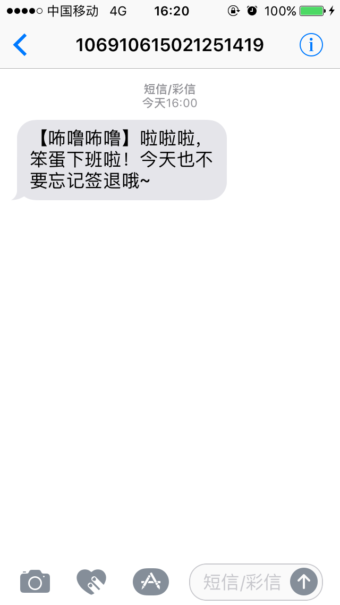

# 阿里大于短信通知

基于阿里大于的短信通知服务，使用node.js发送短信通知。



## 如何运行

1. **Clone仓库:**

  ```
  $ git clone https://github.com/hezhii/dysms.git
  $ cd dysms
  ```

2. **安装依赖:**

  ```
  $ npm install       
  ```
  推荐安装[淘宝npm镜像](https://npm.taobao.org/)，安装成功后使用`cnpm install`安装依赖。
  
4.**启动程序:**
  
  ```
  $ cd demo
  $ KEY_ID=yourAccessKeyId KEY_SECRET=yourAccessKeySecret PHONE_NUM=phoneNum node index.js
  ```